# PolyOS 7 for Debian: project showcase

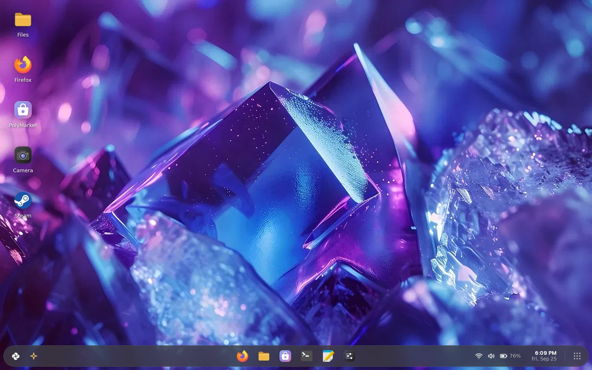

PolyOS started as an operating system built in Scratch by  the
PIXAPoLY Software team. This project, presented by Cryptic Software, turns PolyOS 7
into a real desktop that installs and boots on a PC, on top of Debian.

## What's been built

| | |
|---|---|
| **Login and lock screen** | The PolyOS 7 design: stacked clock, date, *Performance: Optimal*, news and notification tiles over the blurred amethyst crystal; "Enter your password", Forgot Password (recovery key) and Next |
| **Desktop and dock** | Crystal wallpaper, app shortcuts, the capsule dock, a right-click menu; the taskbar can float, stretch edge to edge, align left or hide |
| **Home Menu and launcher** | Calendar, Ask Vara, Run CMD, sliders, pinned and recent apps; a full-screen app grid with search |
| **Widgets** | Weather, calendar, system, news, to-do, notes, photos, world clocks, media |
| **Apps** | Files, Task Manager, Driver Manager, PolyMarket (51 apps from Debian and Flathub, with real icons), Camera |
| **Vara, the AI agent** | Writes and runs code, makes OpenSCAD and Blender models, works with ROS 2 and Arduino; skills, memory, and your approval before any change |
| **Settings** | Appearance, Taskbar & Desktop, Wi-Fi, Sound, Display, Power & Performance, Account, Privacy & Security, Gaming, Developer, Vara, About |
| **Installer** | The PolyOS 7 setup: “Where do you want to install PolyOS?” like Windows Setup (every drive and partition, Delete and New), dual boot next to Windows, or Advanced setup; a “remove the USB drive” message at the end; a PolyOS boot menu on the USB drive (PCs and ARM64) |
| **Editions** | Regular, Developer (change PolyOS's own interface) and Gaming (Steam, Wine, Heroic, Lutris, cloud gaming, Game Mode) |
| **Security and speed** | Firewall and security updates on by default, a security checkup, lock screen guessing protection; zram, SSD trim, faster startup |

## Download

The website's **Download** buttons (one for Intel/AMD PCs, one for ARM64) always offer the newest
[release](https://github.com/kingxxasavan/poly-os-7-debain-receration/releases/latest): it asks GitHub for the
latest release when the page loads, so a new release reaches the site with no changes here.
Releases themselves are automatic: raising the version in `polyos/__init__.py` on `main` builds
both ISOs and publishes them (see the main README).

## Screenshots

| Login | Sign in | Lock screen |
|---|---|---|
| 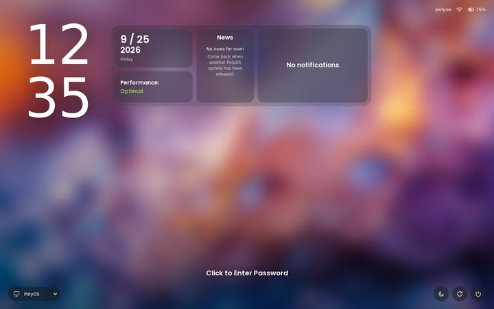 | 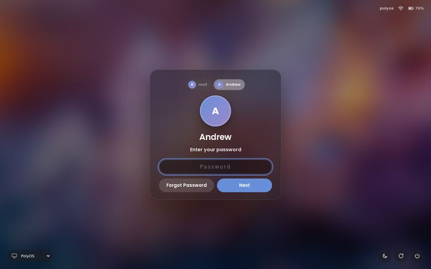 | 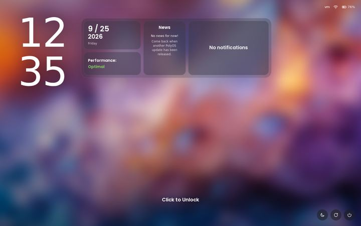 |

| Home Menu | Launcher | Widgets |
|---|---|---|
| 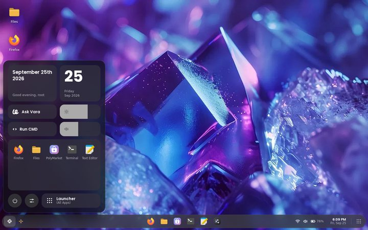 | 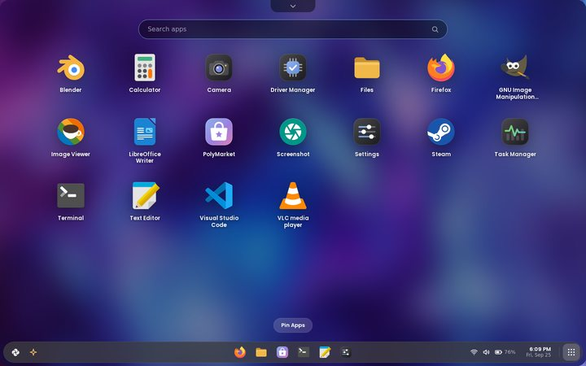 | 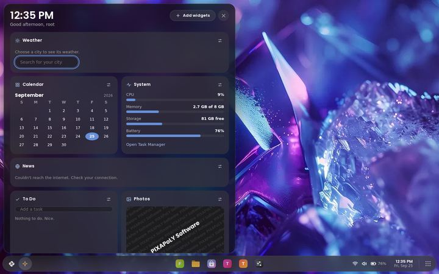 |

| Files | Task Manager | PolyMarket |
|---|---|---|
| 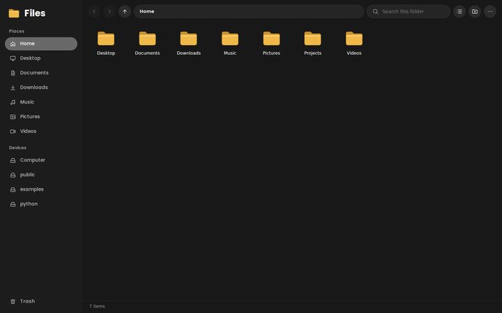 | 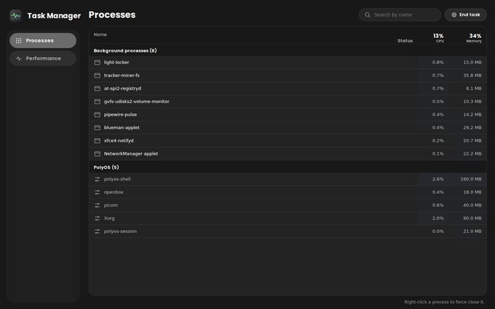 | 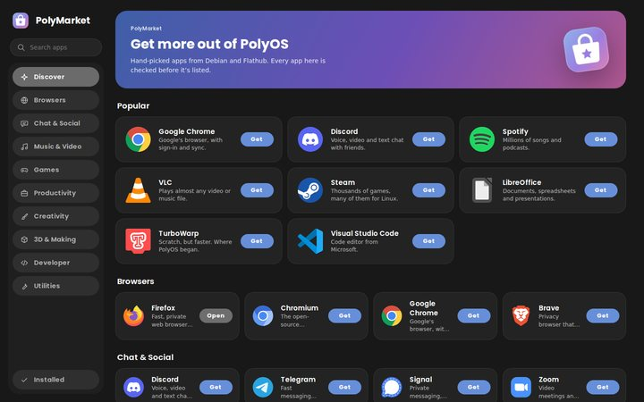 |

| Taskbar settings | Power & Performance | Privacy & Security |
|---|---|---|
| 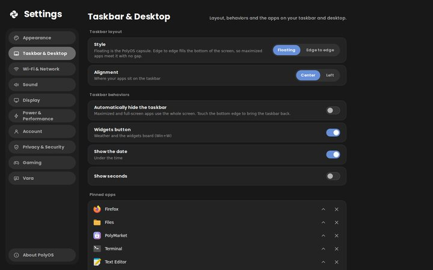 | 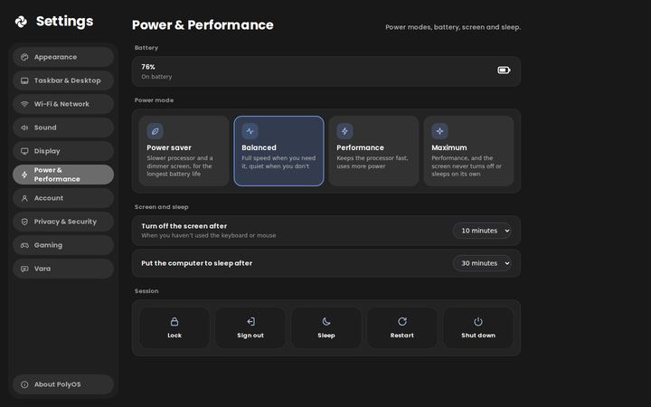 | 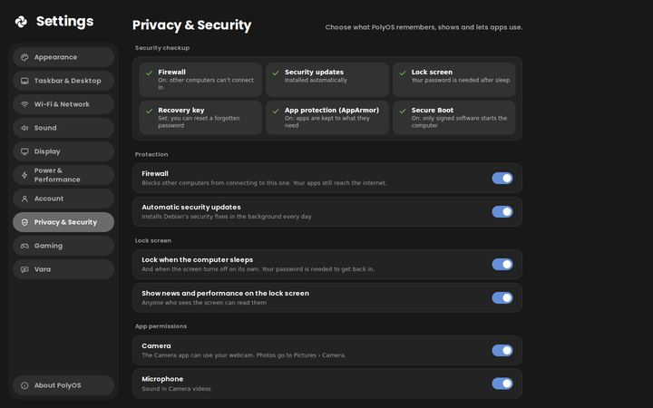 |

| Gaming | Developer | Driver Manager |
|---|---|---|
| 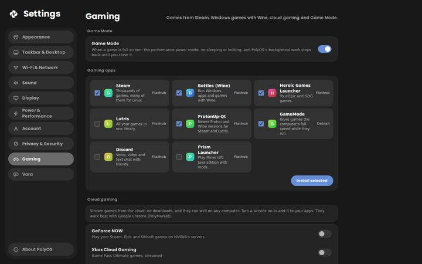 | 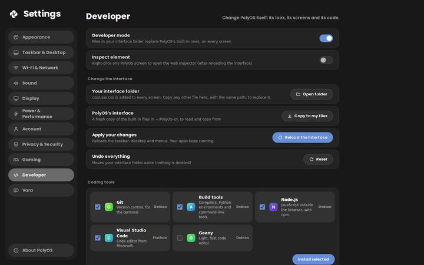 | 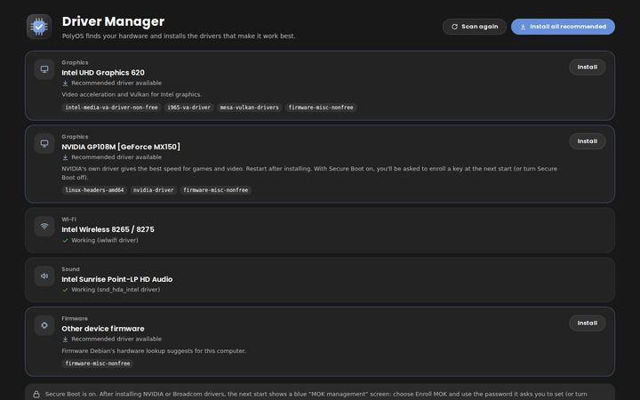 |

| Vara at work | Vara asks first | Settings: Vara |
|---|---|---|
| 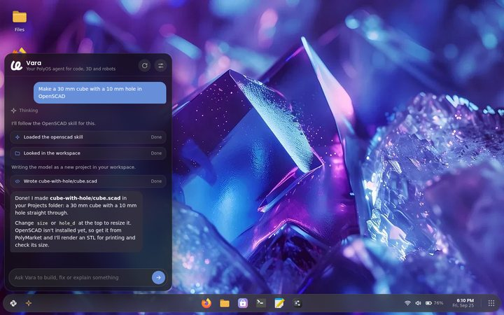 | 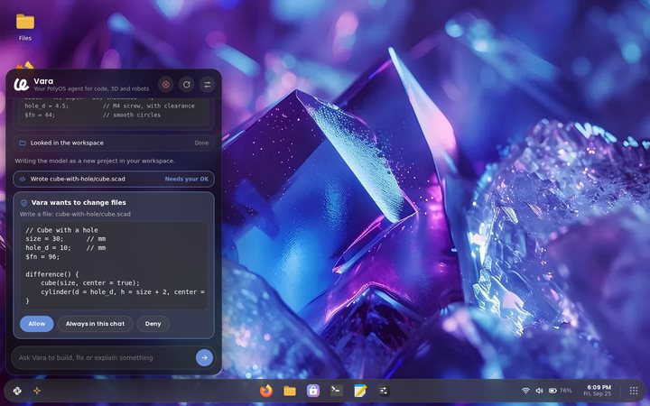 | 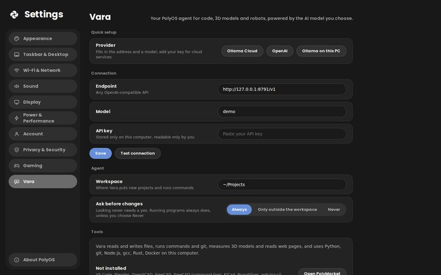 |

| USB boot menu | PolyMarket: 3D & Making | App launcher |
|---|---|---|
| 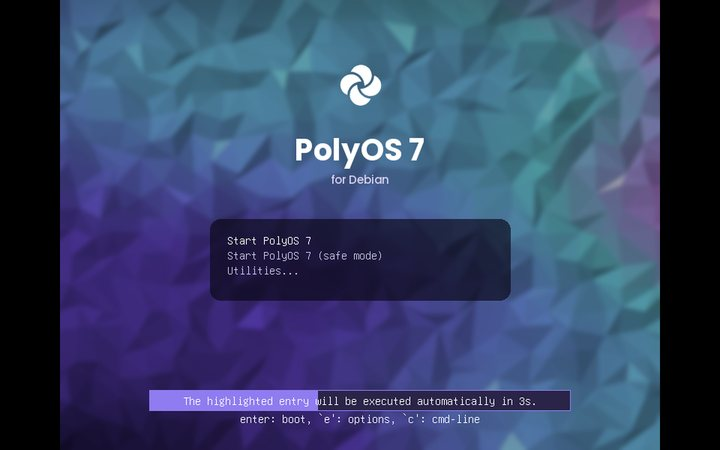 | 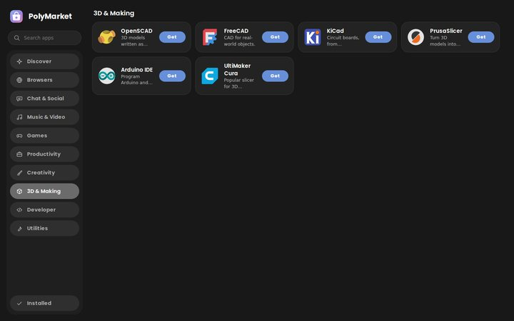 |  |

| Installer: start | Installer: editions | Installer: drives and partitions |
|---|---|---|
| 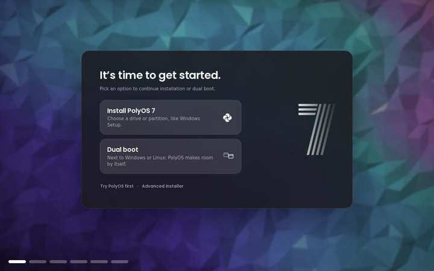 | 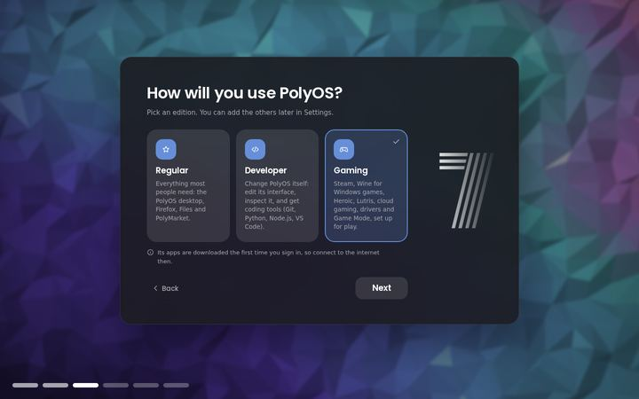 | 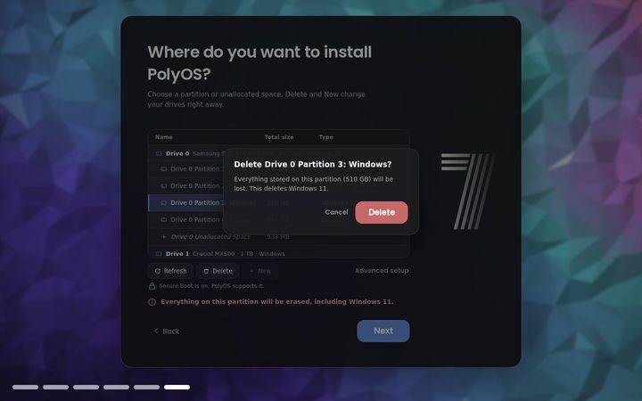 |

All screenshots are full size in [`screenshots/`](screenshots/) (1440×900) with small copies in
[`screenshots/thumbs/`](screenshots/thumbs/).

## Timeline

| Date | What changed |
|---|---|
| Sep 24, 2026 | PolyOS 7 comes to Debian: desktop shell, dock, Home Menu, launcher, Files, Settings, Ask Vara, login screen, boot splash, live USB |
| Sep 24, 2026 | The PolyOS 7 installer, Task Manager, Driver Manager, PolyMarket, dark and light mode |
| Sep 24, 2026 | Windows key opens and closes the Home Menu; the live USB keeps its install card |
| Sep 24, 2026 | Instant lock screen, password recovery keys, widgets board |
| Sep 25, 2026 | PolyOS 7 login and lock screens, crystal wallpapers, Camera, desktop shortcuts, new Settings pages |
| Sep 25, 2026 | Custom installs, Regular / Developer / Gaming editions, security and speed defaults |
| Sep 25, 2026 | Download buttons on the website with an install guide; an ARM64 ISO |
| Sep 25, 2026 | Vara becomes an agent for code, 3D and robots; real app icons; PolyOS USB boot menu; ARM64 USB drives start on UEFI computers |

## Put the website online

### Vercel (set up)

`vercel.json` in the project root tells Vercel to serve this folder as it is (no build step).

1. Sign in at [vercel.com](https://vercel.com) with your GitHub account.
2. **Add New… → Project**, then **Import** `kingxxasavan/poly-os-7-debain-receration`.
3. Leave the settings as they are (Framework Preset: *Other*; `vercel.json` fills in the rest)
   and click **Deploy**.
4. You get an address like `https://poly-os-7.vercel.app`. Every push to `main` updates the site,
   and other branches get their own preview links. Add your own domain under **Settings → Domains**.

From a terminal instead: `npm i -g vercel`, then `vercel --prod` in the project folder.

## Credits

PolyOS was created in Scratch by AndrewInput and PIXAPoLY Software
([scratch.mit.edu/users/PolyOS](https://scratch.mit.edu/users/PolyOS/)); this edition is
presented by Cryptic Software. The PolyOS logo, colors and PIXAPoLY artwork are CC BY-SA 2.0.
The Crystal and Amethyst wallpapers visible in the screenshots are third-party photos (see
`CREDITS.md` in the project root). Poppins font: SIL Open Font License (`assets/fonts/OFL.txt`).
